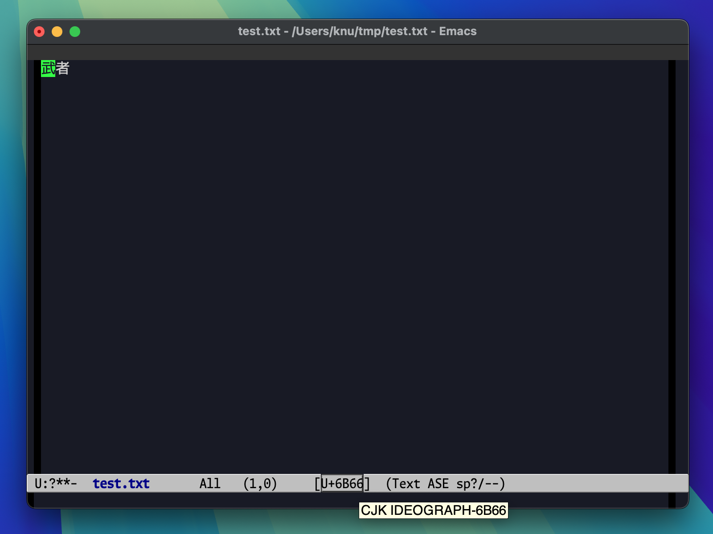
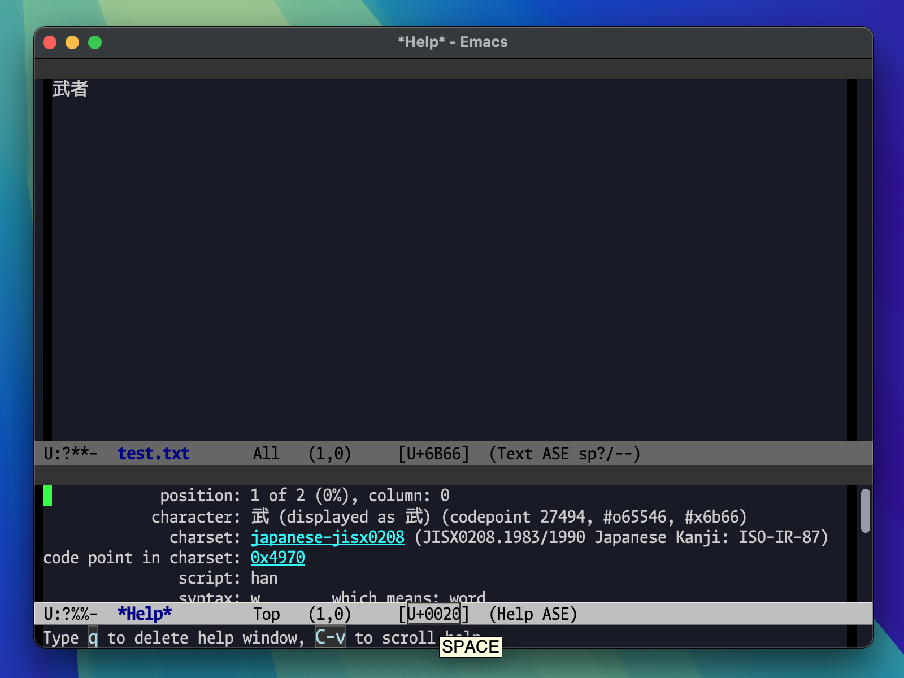

# charinfo.el

This package provides a global minor mode to display Unicode codepoint
and name for the character at point in the mode line.

```emacs-lisp
(charinfo-mode 1)
```

# Screenshots

In `charinfo-mode`, Emacs displays the Unicode codepoint (e.g. U+0061)
for the character at point in the mode line.  When you hover over that
code, a tooltip pops up showing the character's official Unicode name
(e.g. "LATIN SMALL LETTER A"):



And clicking the code opens a `describe-char` help window:



# Customization

- `charinfo-idle-delay` (default: `1.0`)

  Idle time in seconds to wait before updating the character info.

- `charinfo-insert-into` (default: `'mode-line-format`)

  List variable to insert the character info section to.

- `charinfo-insert-after` (default: `'mode-line-position`)

  Where to insert the character info section after in `charinfo-insert-into`.

  This value can be a literal value or a function that takes an
  element to return a non-nil value to tell where to insert the
  charinfo mode-line item at.  If set to t, or none matches, the item
  is inserted at the end.

## Author

Copyright (c) 2025 Akinori Musha.

Licensed under the 2-clause BSD license.  See `LICENSE.txt` for details.

Visit [GitHub Repository](https://github.com/knu/charinfo.el) for the latest information.
